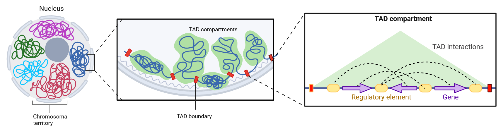
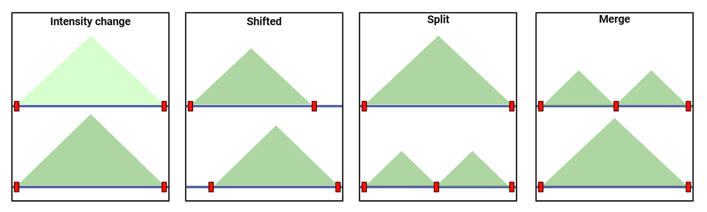

# CTADo: <a href="">
**Comparison tool for Topologically Associated Domains**
<picture>
  <source media="(prefers-color-scheme: dark)" srcset="./img/CTADOw.png">
  <source media="(prefers-color-scheme: light)" srcset="./img/CTADOw.png">
</picture>

*TADs* are smaller structural units of chromosomes that are defined as regions whose DNA sequences preferentially contact each other. <br />

The three-dimensional (3D) genome organization has the importance of tin regulating gene expression and other genomic processes. Many such domains change during development or disease, and exhibit cell- and condition specific differences. 

<br />
<div style='justify-content: center'>

</div>
<br />

In Hi-C maps, TADs are represented as blocks along the diagonal with sizes ranging from about 100 kilobases to 2 megabases, and they indicate increased interactions among chromatin elements within the domain compared to the upstream and downstream regions.


<div style='justify-content: center'>

</div>
<br />

We developing CTADo for differential analysis of boundaries of interacting domains between two Hi-C datasets. Our tool aimed at providing a accurate, user-friendly approach to differential analysis of boundaries of TADs.

We introduce a method based on the given TAD boundaries and use it to identify four types of boundary changes: intensity change, shifted, merge and split. 

<div style='justify-content: center'>

</div>
<br />

In summary, CTADo is providing analyses from boundary calling to visualization.

**CTADO** documentation is available on the GitHub [wiki page](https://github.com/ivandkoz/differential-computing-TADs/wiki).
<br />

### Installation
To get the tool CTADo clone the git repository:

```
git clone git@github.com:ivandkoz/CTADo.git && cd CTADo
```
To create conda enviroment using enviroment.yml file:
```
conda env create --name ctado -f environment.yml
conda activate ctado
```

### Usage

To run the `CTADO.py` script, you can call it from the directory where the tool is located. <br />
For tool usage the names of mcool or cool files, resolution, window, binsize and file that contains TADs insulating boundaries must be provided.  

This file can be retrieved using:
* [cooltools](https://github.com/open2c/cooltools)
* [Armatus](https://github.com/kingsfordgroup/armatus)
* use the built-in function (based on cooltools TADs boundary markup) - you can run script without providing TADs insulating boundaries file name (exanple in GitHub wiki)

####
Vizualisation the results of intensity type of boundary changes are included in `CTADo.py`. <br />
By default, the program creates the top 5 most changed by intensity type of TADs. To use it, mcool or cool files, resolution, window, binsize, both files that contains TADs insulating boundaries, and result of `CTADO.py` script - dataframe with intensity information - must be provided. 
You can see an example of graphic below.
<br />
<br />

### Example
Run command below to see usage and arguments:

```bash
python CTADO.py -h
```

```bash
usage: Differential analysis of interacting domains between two contact matrices [-h] [-r1 RESULT_DF_1_NAME]
                                                                                 [-r2 RESULT_DF_2_NAME]
                                                                                 [-df RESULT_DATAFRAME_NAME]
                                                                                 [-od OUTPUT_DIRECTORY]
                                                                                 [-nc NUMBER_OF_CHARTS]
                                                                                 [-lg {True,False}] [-t THREADS]
                                                                                 clr1_filename clr2_filename
                                                                                 resolution window flank binsize
                                                                                 clr1_boundaries_name
                                                                                 clr2_boundaries_name

This tool is needed to find four types of changes in TADs between two contact matrices

positional arguments:
  clr1_filename         Name of first contact matrix in mcool/cool format
  clr2_filename         Name of second contact matrix in mcool/cool format
  resolution            Resolution of mcool file
  window                Size of the sliding diamond window
  flank                 Flank size in bp
  binsize               Bin size in bp
  clr1_boundaries_name  The first contact matrix boundaries argument, a dataframe name with TADs boundaries in
                        chrom, start, end format or cooler insulation table
  clr2_boundaries_name  The second contact matrix boundaries argument, a dataframe name with TADs boundaries in
                        chrom, start, end format or cooler insulation table

options:
  -h, --help            show this help message and exit
  -r1 RESULT_DF_1_NAME, --result_df_1_name RESULT_DF_1_NAME
                        The first contact matrix dataframe name with chrom, start & end of TADs (default: None)
  -r2 RESULT_DF_2_NAME, --result_df_2_name RESULT_DF_2_NAME
                        The second contact matrix dataframe name with chrome, start & end of TADs (default: None)
  -df RESULT_DATAFRAME_NAME, --result_dataframe_name RESULT_DATAFRAME_NAME
                        Dataframe name with intersecting TADs of two contact matrices (default: None)
  -od OUTPUT_DIRECTORY, --output_directory OUTPUT_DIRECTORY
                        The path to the save directory (default: /home/ivandkoz/test_tad_2/differential-computing-
                        TADs)
  -nc NUMBER_OF_CHARTS, --number_of_charts NUMBER_OF_CHARTS
                        The number of output charts for each type of change. If the specified number is greater than
                        the number of events, then all of them will be output. If number is -1 than all of them will
                        be output. (default: 5)
  -lg {True,False}, --logging {True,False}
                        Enables logging (default: False)
  -t THREADS, --threads THREADS
                        Parameter for specifying the number of threads (default: 1)

Good luck! (∿°○°)∿ .・。.・゜✭・.・。.・゜✭・.・。.・゜✭
```

To perform the test run use:
```
 python CTADO.py 4DNFIL6BHWZL_rs.mcool 4DNFIHXCPUAP_rs.mcool 100000 400000 200000 100000 4DNFIL6BHWZL_rs.mcool_400000_boundaries.csv 4DNFIHXCPUAP_rs.mcool_400000_boundaries.csv -od ctado_test -nc 3
```
or
```
python tads_intensity.py 4DNFIL6BHWZL_rs.mcool 4DNFIHXCPUAP_rs.mcool 100000 400000 200000 100000 4DNFIL6BHWZL_rs.mcool_400000_boundaries.csv 4DNFIHXCPUAP_rs.mcool_400000_boundaries.csv --save True -r1 4DNFIL6BHWZL_rs.mcool_400000_result_df.csv -r2 4DNFIHXCPUAP_rs.mcool_400000_result_df.csv -df intensity_change_result.csv
```

Additionaly, you can see the whole example in [GitHub Wiki](https://github.com/ivandkoz/differential-computing-TADs/wiki/3.-Example).

<br />
Example of graphic:
<br />
<div style='justify-content: center'>

</div>
<br />


Example of split graphic:

